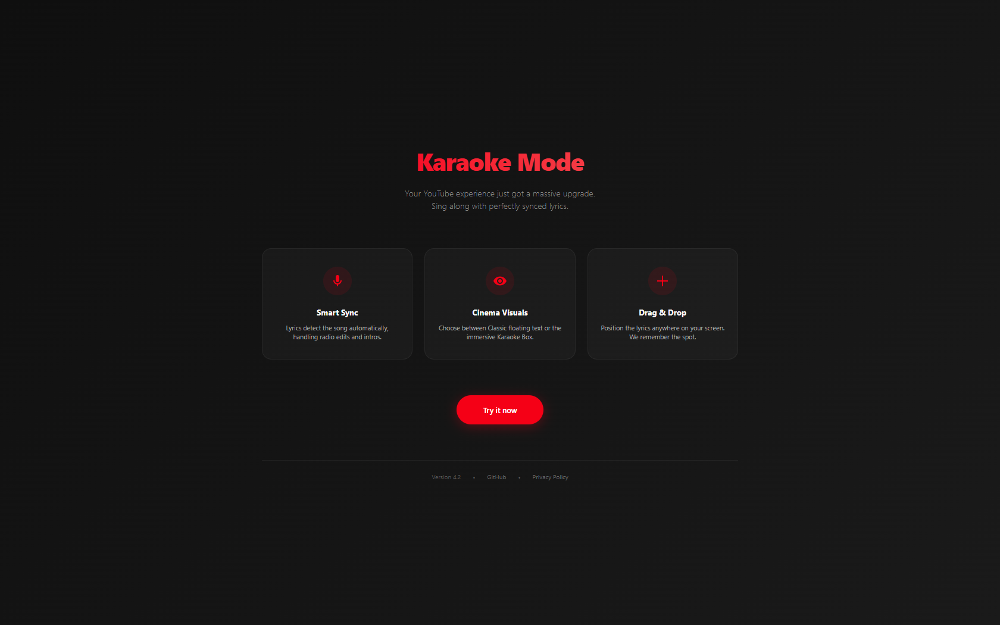
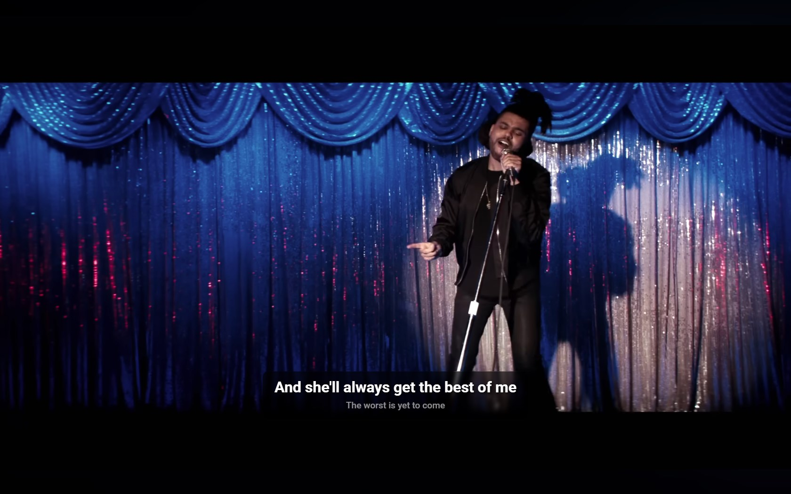
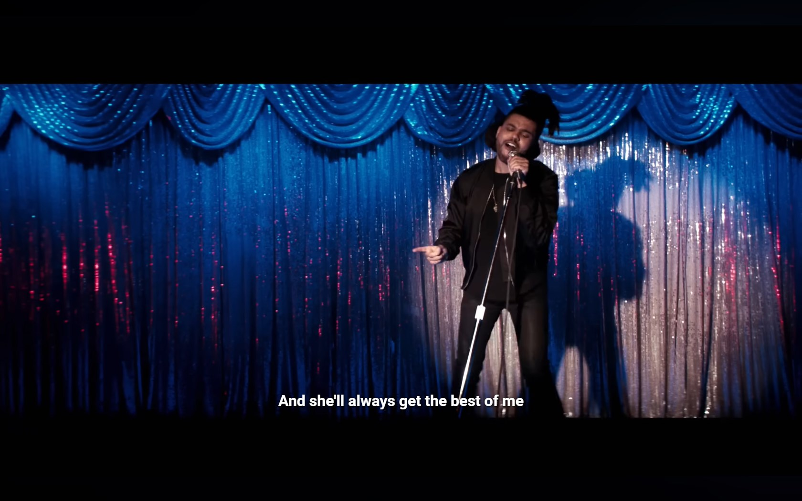

# 🎤 YouTube Karaoke Mode

> **A Chromium Extension that transforms YouTube into a synchronized Karaoke machine.**
> Features a "Netflix-style" overlay, smart metadata detection, and drag-and-drop UI.


## 📸 Overview

**Onboarding Experience**
<p align="center">
  
</p>

## ✨ Features

- **Synced Lyrics:** Fetches real-time synchronized lyrics using the [Lrclib](https://lrclib.net/) API.
- **Dual Display Modes:**
  - **Karaoke Mode:** Immersive, semi-transparent container with "Next Line" preview (seen above).
  - **Classic Mode:** Minimalist floating text for a cleaner look.
- **Smart Metadata Engine:**
  - **Tier 1:** Uses the `MediaSession API` for 100% accurate Artist/Title detection directly from the browser's audio engine.
  - **Tier 2:** Fallback DOM scraper with regex sanitization (Removes "Official Video", "ft.", "VEVO", " - Topic").
- **Smart Sync:** Uses fuzzy duration matching (±10s variance) to prevent mismatched lyrics (e.g., Radio Edit vs Extended Mix).
- **Pro Control Panel:**
  - Drag & Drop positioning (Coordinates saved to Storage).
  - Adjustable Sync Offset (±10s).
  - Custom Font Size & Cinema Color Presets.
- **Instrumental Detection:** Automatically detects non-vocal tracks and displays a badge.
- **Ad Detection:** Automatically hides the overlay when YouTube plays an ad.

## 🎨 Gallery

| **Karaoke Mode** | **Classic Mode** |
|:---:|:---:|
|  |  |
| *Dark mode popup with sync sliders and color swatches* | *Minimalist floating lyrics* |

**Control Center**
<p align="center">
  
</p>

## 🛠️ Installation

1.  Clone this repository:
    ```bash
    git clone [https://github.com/Maadalla/youtube-karaoke-mode.git]
    ```
2.  Open Chrome and navigate to `chrome://extensions`.
3.  Toggle **Developer mode** (top right switch).
4.  Click **Load unpacked**.
5.  Select the folder where you cloned this repo.
6.  Go to YouTube, play a music video, and enjoy!

## 🧩 Architecture & Engineering

This extension is built on **Manifest V3** and solves several complex challenges associated with YouTube's Single Page Application (SPA) architecture:

### 1. The Hybrid Search Engine
To find the correct lyrics, the extension uses a waterfall strategy:
* **MediaSession:** First, we query `navigator.mediaSession.metadata`. This usually provides the clean artist and title (e.g., "The Weeknd - Call Out My Name") without the "garbage" text often found in YouTube video titles.
* **DOM Scraper:** If MediaSession is empty, we scrape the video title and channel name.
* **The Sanitizer:** We apply rigorous Regex cleaning to strip suffixes like `VEVO`, `Official Video`, and the common YouTube auto-generated suffix ` - Topic` (e.g., converting "Bekar - Topic" to "Bekar").

### 2. State Persistence
User preferences (Font size, colors, box position) are stored in `chrome.storage.sync`. The lyrics box uses a custom Drag & Drop implementation that saves X/Y coordinates relative to the video player center, ensuring the box stays in place even if the browser window resizes.

### 3. SPA Navigation
Since YouTube doesn't reload the page when you click a new video, the extension uses a `MutationObserver` to watch the `<title>` tag and navigation events, triggering a new lyric fetch instantly upon video change.

## 🚀 Roadmap

- [x] Initial Release
- [x] Drag & Drop UI
- [x] "Topic" Channel Bug Fix
- [x] Netflix-style UI Mode
- [ ] Spotify Web Player Integration
- [ ] Multi-language translation support


---
*Disclaimer: This extension is for educational purposes. Lyrics are provided by the Lrclib.net API.*